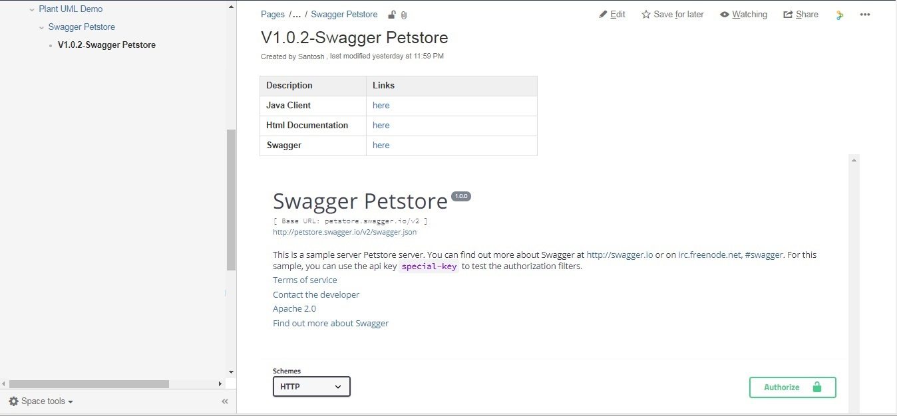

[](https://travis-ci.org/kicksolutions/swagger2confluence)
[](https://oss.sonatype.org/#nexus-search;gav~io.github.kicksolutions~swagger-confluence-core~~~)

# Swagger2Confluence

Swagger to Confluence tool helps to publish Swagger Definitions to Confluence Page.

This Project is based on Maven and plan to support Gradle also in future.
Following are modules we currently have 

- swagger2confluence-core
- swagger2confluence-maven

Following are the tools which this project internally uses:

- [Swagger Parser]
- [Confluence REST Services]

# How does it work

- Swagger2Confluence internally reads the swagger definition using [Swagger Parser] which then uploads to confluence page
based on the attributes provided.

It will first Create Page whose Title = Title of API Specified in Swagger then creates child under it with Version-Title of API


Confluence Page Uses Swagger Macro, this will help us to see full view of Swagger inside Confluence

## swagger2confluence-core: 

This utility takes Swagger Yaml as input and as response it uploads to Confluence Page.

Below is the Sample Confluence Page Output which gets imported.


### Usage:

```
java -cp swagger2confluence.jar com.kicksolutions.swagger.confluence.Swagger2Confluence [options]

-i {Path of Swagger Definition (Can be either Yaml or json)}
-a {Parent Page Id of Confluence}
-u {User Name}
-p {password}
-l {Confluence REST URL}
-s {Confluence Space key}
-r {URL of Swagger from Maven} (Optional)
-c {Generated Clientkit URL/Generate Clientkit URL of Swagger Online} (Optional)
-d {Generated HTML documentation of Swagger} (Optional)

```

## swagger2confluence-maven

This Maven plugin is Mojo, which internally calls swagger2confluence-core to upload Swagger Definition.
Swagger Definition can be either yaml or json extensions.

License
----

Apacahe 2.0

[Swagger]: <https://swagger.io/>
[Swagger Parser]: <https://github.com/swagger-api/swagger-parser>
[Confluence REST Services]: <https://developer.atlassian.com/confdev/confluence-server-rest-api/confluence-rest-api-examples>
